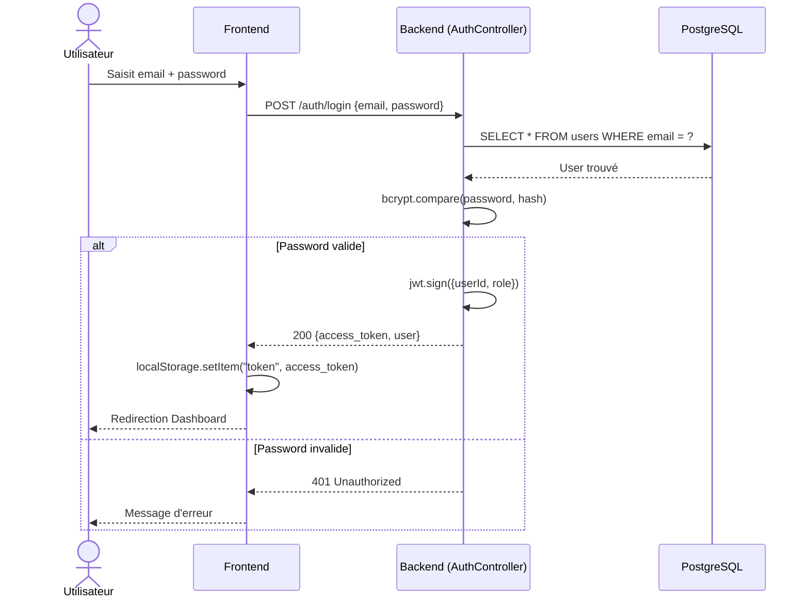
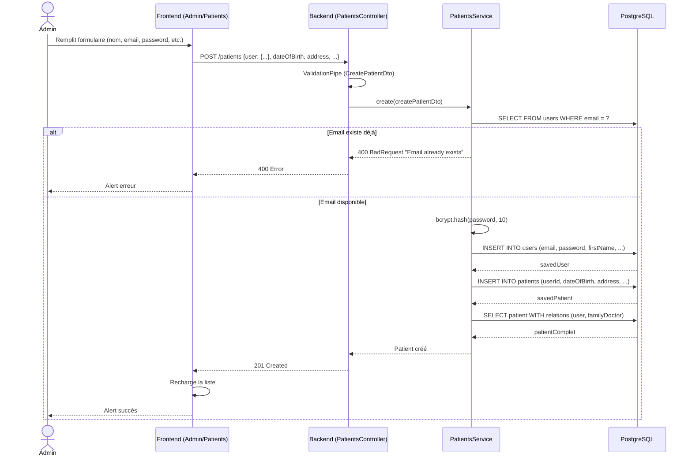
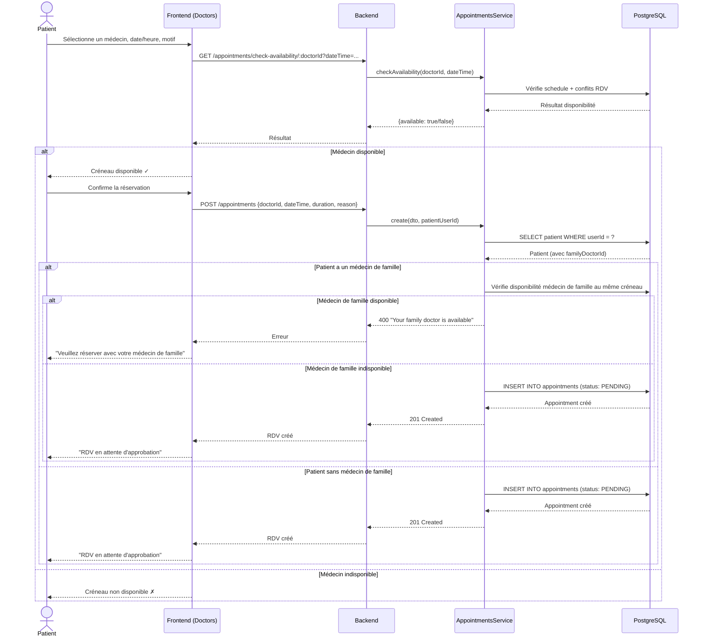
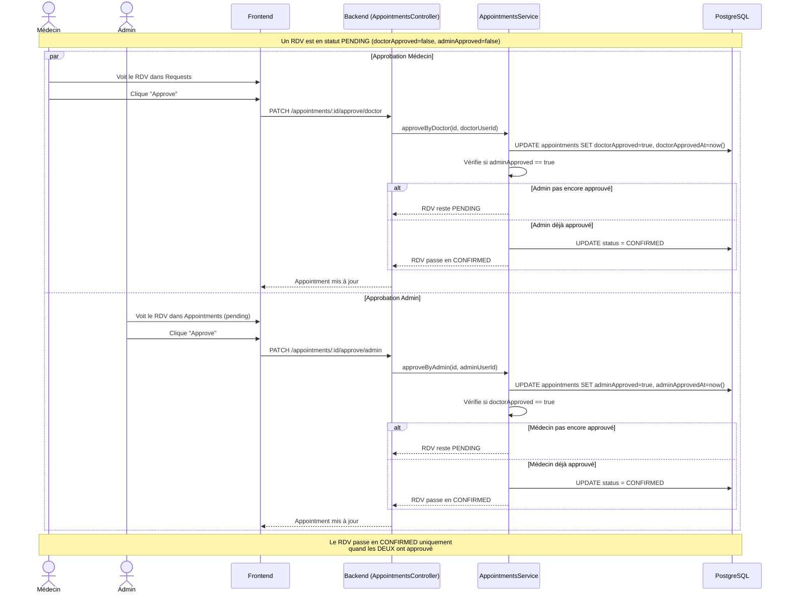
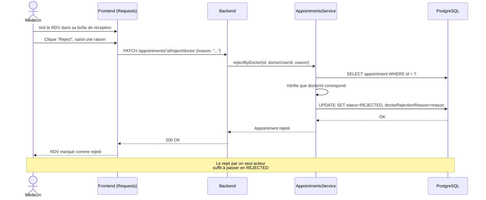
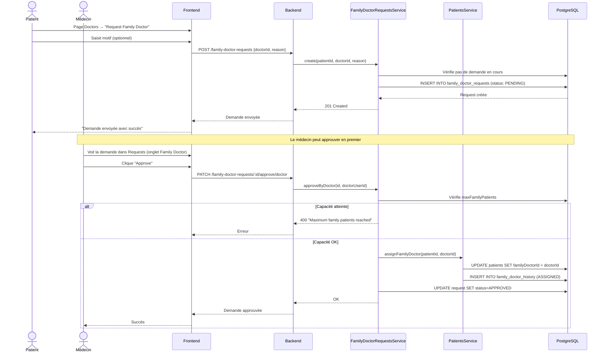
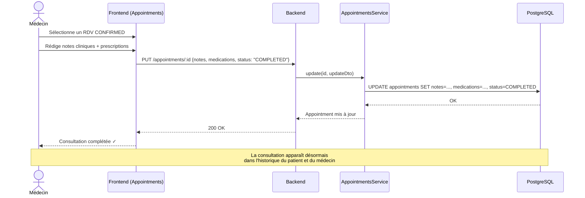
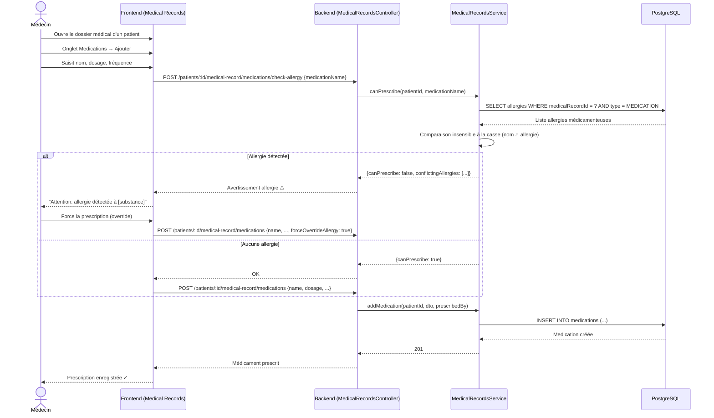

# Architecture Système de Gestion Médicale

**Version:** 2.0
**Date:** 2026-02-19
**Statut:** Design & Implémentation

---

## Table des Matières

1. [Vue d'Ensemble](#1-vue-densemble)
2. [Acteurs et Profils](#2-acteurs-et-profils)
3. [Cas d'Utilisation](#3-cas-dutilisation)
4. [Diagrammes de Séquence](#4-diagrammes-de-séquence)
5. [Architecture Technique](#5-architecture-technique)
6. [Modèle de Données](#6-modèle-de-données)
7. [Système de Permissions](#7-système-de-permissions)
8. [API Endpoints](#8-api-endpoints)
9. [Règles Métier](#9-règles-métier)
10. [Plan d'Évolution](#10-plan-dévolution)

---

## 1. Vue d'Ensemble

### 1.1 Description du Système

Le système MedApp est une application de gestion médicale clinique permettant la gestion des patients, médecins, rendez-vous, dossiers médicaux et demandes de médecin de famille. L'application suit un modèle trois-tiers avec un frontend Next.js, un backend NestJS et une base de données PostgreSQL.

### 1.2 Stack Technique

| Couche | Technologie |
|--------|-------------|
| Frontend | Next.js 14 (App Router), TypeScript, Tailwind CSS |
| Backend | NestJS, TypeORM, class-validator |
| Base de données | PostgreSQL |
| Authentification | JWT (Passport.js) |
| API | REST |

### 1.3 Architecture Globale

```
┌──────────────────┐     ┌──────────────────┐     ┌──────────────────┐
│   Frontend        │     │   Backend         │     │   PostgreSQL     │
│   Next.js :3000   │────▶│   NestJS :3001    │────▶│   :5432          │
│                   │◀────│                   │◀────│                  │
│  - Pages/Routes   │     │  - Controllers    │     │  - users         │
│  - Components     │     │  - Services       │     │  - patients      │
│  - API Client     │     │  - Guards         │     │  - doctors       │
│  - Auth Context   │     │  - Entities       │     │  - appointments  │
│                   │     │  - DTOs           │     │  - medical_*     │
└──────────────────┘     └──────────────────┘     └──────────────────┘
```

---

## 2. Acteurs et Profils

### 2.1 Administrateur (ADMIN)

**Rôle :** Gestionnaire principal de la clinique. Responsable de l'inscription des patients et médecins, de la gestion des demandes, et de l'approbation administrative des rendez-vous.

**Accès UI :**
- Dashboard (statistiques globales)
- Appointments (tous les rendez-vous, approbation admin)
- Admin > Overview (liste utilisateurs, stats)
- Admin > Patients (CRUD patients, modal détaillé avec 4 onglets)
- Admin > Doctors (CRUD médecins, planning, disponibilité)
- Admin > Family Doctor Requests (approuver/rejeter demandes)

### 2.2 Médecin (DOCTOR)

**Rôle :** Praticien médical. Peut consulter ses patients, gérer ses rendez-vous, approuver ou rejeter les demandes de rendez-vous et de médecin de famille, et mettre à jour les dossiers médicaux.

**Accès UI :**
- Dashboard
- Appointments (propres rendez-vous, calendrier, approbation médecin)
- Consultations (historique des consultations passées avec filtres)
- Requests (boîte de réception: demandes de RDV + demandes médecin de famille)
- Patient Folder (liste patients, modal détaillé avec 3 onglets)

### 2.3 Patient (PATIENT)

**Rôle :** Utilisateur du service médical. Peut prendre rendez-vous, consulter ses propres données médicales, voir la liste des médecins disponibles, et demander un médecin de famille.

**Accès UI :**
- Dashboard
- Appointments (propres rendez-vous, prise de RDV)
- Consultations (historique des consultations terminées)
- Doctors (parcourir médecins, réserver RDV, demander médecin de famille)

---

## 3. Cas d'Utilisation

### 3.1 Diagramme des Cas d'Utilisation par Acteur

```
┌─────────────────────────────────────────────────────────────────────────────┐
│                          SYSTÈME MEDAPP                                     │
│                                                                             │
│  ┌─────────────────────────────────────────────────────────┐                │
│  │                    AUTHENTIFICATION                      │                │
│  │  UC-AUTH-01: Se connecter                                │◄─── Tous      │
│  │  UC-AUTH-02: Voir son profil                             │◄─── Tous      │
│  └─────────────────────────────────────────────────────────┘                │
│                                                                             │
│  ┌─────────────────────────────────────────────────────────┐                │
│  │                GESTION DES PATIENTS                      │                │
│  │  UC-PAT-01: Créer un patient (user + profil)             │◄─── Admin     │
│  │  UC-PAT-02: Lister tous les patients                     │◄─── Admin/Doc │
│  │  UC-PAT-03: Voir le détail d'un patient                  │◄─── Admin/Doc │
│  │  UC-PAT-04: Modifier un patient                          │◄─── Admin     │
│  │  UC-PAT-05: Supprimer un patient                         │◄─── Admin     │
│  │  UC-PAT-06: Voir son propre profil                       │◄─── Patient   │
│  └─────────────────────────────────────────────────────────┘                │
│                                                                             │
│  ┌─────────────────────────────────────────────────────────┐                │
│  │                GESTION DES MÉDECINS                      │                │
│  │  UC-DOC-01: Créer un médecin (user + profil)             │◄─── Admin     │
│  │  UC-DOC-02: Lister tous les médecins                     │◄─── Tous      │
│  │  UC-DOC-03: Modifier le profil/planning d'un médecin     │◄─── Admin/Doc │
│  │  UC-DOC-04: Activer/Désactiver disponibilité             │◄─── Admin     │
│  │  UC-DOC-05: Supprimer un médecin                         │◄─── Admin     │
│  │  UC-DOC-06: Voir ses statistiques                        │◄─── Doc/Admin │
│  └─────────────────────────────────────────────────────────┘                │
│                                                                             │
│  ┌─────────────────────────────────────────────────────────┐                │
│  │                GESTION DES RENDEZ-VOUS                   │                │
│  │  UC-RDV-01: Demander un rendez-vous                      │◄─── Patient   │
│  │  UC-RDV-02: Créer un rendez-vous (directement confirmé)  │◄─── Médecin   │
│  │  UC-RDV-03: Approuver un RDV (côté médecin)              │◄─── Médecin   │
│  │  UC-RDV-04: Rejeter un RDV (côté médecin)                │◄─── Médecin   │
│  │  UC-RDV-05: Approuver un RDV (côté admin)                │◄─── Admin     │
│  │  UC-RDV-06: Rejeter un RDV (côté admin)                  │◄─── Admin     │
│  │  UC-RDV-07: Annuler un rendez-vous                       │◄─── Tous      │
│  │  UC-RDV-08: Compléter un rendez-vous (notes, médic.)     │◄─── Médecin   │
│  │  UC-RDV-09: Voir ses rendez-vous                         │◄─── Tous      │
│  │  UC-RDV-10: Voir l'historique des consultations           │◄─── Doc/Pat  │
│  └─────────────────────────────────────────────────────────┘                │
│                                                                             │
│  ┌─────────────────────────────────────────────────────────┐                │
│  │             MÉDECIN DE FAMILLE                           │                │
│  │  UC-MF-01: Assigner un médecin de famille                │◄─── Admin     │
│  │  UC-MF-02: Changer le médecin de famille                 │◄─── Admin     │
│  │  UC-MF-03: Retirer le médecin de famille                 │◄─── Admin     │
│  │  UC-MF-04: Demander un médecin de famille                │◄─── Patient   │
│  │  UC-MF-05: Approuver demande médecin de famille          │◄─── Admin/Doc │
│  │  UC-MF-06: Rejeter demande médecin de famille            │◄─── Admin/Doc │
│  │  UC-MF-07: Voir historique changements médecin famille    │◄─── Admin/Doc │
│  └─────────────────────────────────────────────────────────┘                │
│                                                                             │
│  ┌─────────────────────────────────────────────────────────┐                │
│  │              DOSSIERS MÉDICAUX                           │                │
│  │  UC-DM-01: Voir le dossier médical complet               │◄─── Admin/Doc │
│  │  UC-DM-02: Voir son propre dossier médical               │◄─── Patient   │
│  │  UC-DM-03: Mettre à jour les informations vitales        │◄─── Doc/Admin │
│  │  UC-DM-04: Ajouter une condition médicale                │◄─── Doc/Admin │
│  │  UC-DM-05: Ajouter une allergie                          │◄─── Doc/Admin │
│  │  UC-DM-06: Prescrire un médicament                       │◄─── Doc/Admin │
│  │  UC-DM-07: Vérifier interaction allergie/médicament       │◄─── Doc/Admin │
│  │  UC-DM-08: Arrêter un médicament                         │◄─── Doc/Admin │
│  │  UC-DM-09: Enregistrer une vaccination                   │◄─── Doc/Admin │
│  └─────────────────────────────────────────────────────────┘                │
└─────────────────────────────────────────────────────────────────────────────┘
```

### 3.2 Description Détaillée des Cas d'Utilisation

#### UC-RDV-01: Demander un rendez-vous (Patient)

| Champ | Description |
|-------|-------------|
| **Acteur** | Patient |
| **Préconditions** | Patient connecté, médecin disponible |
| **Postconditions** | RDV créé en statut PENDING |
| **Scénario nominal** | 1. Patient consulte la liste des médecins<br>2. Patient sélectionne un médecin<br>3. Patient choisit date/heure et saisit un motif<br>4. Système vérifie la disponibilité du médecin<br>5. Si patient a un médecin de famille ET celui-ci est disponible au même créneau → bloquer (BR-A-002)<br>6. RDV créé en PENDING<br>7. Notification au médecin et admin |
| **Scénarios alternatifs** | 5a. Médecin de famille indisponible → OK avec autre médecin<br>5b. Patient sans médecin de famille → OK avec tout médecin |

#### UC-RDV-03/05: Double Approbation d'un Rendez-vous

| Champ | Description |
|-------|-------------|
| **Acteurs** | Médecin + Admin |
| **Préconditions** | RDV en statut PENDING |
| **Postconditions** | RDV passe en CONFIRMED quand les deux ont approuvé |
| **Scénario nominal** | 1. Médecin voit le RDV dans ses Requests<br>2. Médecin approuve → `doctorApproved = true`<br>3. Admin voit le RDV dans Appointments (pending)<br>4. Admin approuve → `adminApproved = true`<br>5. Statut passe automatiquement à CONFIRMED |
| **Scénarios alternatifs** | 2a. Médecin rejette (raison obligatoire) → statut REJECTED<br>4a. Admin rejette (raison obligatoire) → statut REJECTED |

#### UC-MF-04: Demander un médecin de famille (Patient)

| Champ | Description |
|-------|-------------|
| **Acteur** | Patient |
| **Préconditions** | Patient connecté, pas de demande en cours, pas déjà affecté au même médecin |
| **Postconditions** | Demande créée en PENDING |
| **Scénario nominal** | 1. Patient parcourt la liste des médecins<br>2. Patient clique "Request Family Doctor"<br>3. Patient saisit un motif (optionnel)<br>4. Système vérifie les contraintes<br>5. Demande créée en PENDING |
| **Scénarios alternatifs** | 4a. Demande en cours déjà → erreur<br>4b. Déjà médecin de famille de ce médecin → erreur |

#### UC-DM-06: Prescrire un médicament (Médecin)

| Champ | Description |
|-------|-------------|
| **Acteur** | Médecin |
| **Préconditions** | Médecin connecté, accès au dossier médical du patient |
| **Postconditions** | Médicament ajouté au dossier |
| **Scénario nominal** | 1. Médecin ouvre le dossier médical du patient<br>2. Médecin saisit le médicament (nom, dosage, fréquence)<br>3. Système vérifie allergies connues (BR-DM-007)<br>4. Aucune interaction → médicament prescrit<br>5. `prescribedBy` auto-renseigné avec l'ID du médecin |
| **Scénarios alternatifs** | 3a. Allergie détectée → avertissement<br>3b. Médecin force la prescription (`forceOverrideAllergy=true`) → médicament prescrit avec mention |

---

## 4. Diagrammes de Séquence

### 4.1 Authentification (Login)



### 4.2 Création d'un Patient (Admin)



### 4.3 Prise de Rendez-vous (Patient)



### 4.4 Double Approbation d'un Rendez-vous



### 4.5 Rejet d'un Rendez-vous



### 4.6 Demande de Médecin de Famille (Patient → Médecin/Admin)



### 4.7 Compléter une Consultation (Médecin)



### 4.8 Prescription avec Vérification d'Allergie



---

## 5. Architecture Technique

### 5.1 Structure du Projet

```
med/
├── backend/
│   ├── src/
│   │   ├── appointments/       # Gestion des rendez-vous
│   │   ├── auth/               # Authentification JWT, guards, decorators
│   │   ├── common/             # Guards partagés (CanManagePatients, CanViewPatient)
│   │   ├── doctors/            # Gestion des médecins
│   │   ├── family-doctor-requests/  # Demandes de médecin de famille
│   │   ├── history/            # Historique changements médecin de famille
│   │   ├── medical-records/    # Dossiers médicaux (conditions, allergies, medications, vaccinations)
│   │   ├── patients/           # Gestion des patients
│   │   ├── users/              # Gestion des utilisateurs
│   │   ├── app.module.ts       # Module racine
│   │   └── main.ts             # Point d'entrée
│   └── scripts/                # Seeds, migrations, utilitaires
├── frontend/
│   ├── src/
│   │   ├── app/(dashboard)/    # Pages protégées
│   │   │   ├── admin/          # Pages admin (patients, doctors, requests)
│   │   │   ├── appointments/   # Calendrier & liste rendez-vous
│   │   │   ├── consultations/  # Historique consultations
│   │   │   ├── dashboard/      # Dashboard principal
│   │   │   ├── doctors/        # Liste médecins (patient)
│   │   │   ├── patients/       # Dossier patients (médecin)
│   │   │   ├── requests/       # Boîte de réception médecin
│   │   │   └── layout.tsx      # Sidebar + navigation par rôle
│   │   ├── components/         # Composants réutilisables (Modal, Badge, DataTable, etc.)
│   │   ├── lib/                # API client, auth context
│   │   └── types/              # Interfaces TypeScript
│   └── ...
└── docs/                       # Documentation
```

### 5.2 Flux d'Authentification

```
1. POST /auth/login → JWT token
2. Token stocké dans localStorage
3. Intercepteur Axios ajoute "Authorization: Bearer <token>" à chaque requête
4. Backend: AuthGuard('jwt') vérifie le token
5. Backend: RolesGuard vérifie le rôle de l'utilisateur
6. Backend: Guards spécifiques vérifient les permissions contextuelles
```

---

## 6. Modèle de Données

### 6.1 Diagramme Entité-Relation

```
┌──────────────┐     ┌──────────────────┐     ┌──────────────┐
│    users      │     │   appointments    │     │   doctors     │
├──────────────┤     ├──────────────────┤     ├──────────────┤
│ id (PK)       │     │ id (PK)           │     │ id (PK)       │
│ email (unique)│     │ patientId (FK)    │     │ userId (FK)   │
│ password      │     │ doctorId (FK)     │     │ specialty     │
│ firstName     │     │ dateTime          │     │ licenseNumber │
│ lastName      │     │ duration          │     │ bio           │
│ phone         │     │ status            │     │ address       │
│ role (enum)   │     │ reason            │     │ consultDur.   │
│ isActive      │     │ notes             │     │ isAvailable   │
│ timestamps    │     │ medications       │     │ schedule(JSON)│
└──────┬───────┘     │ doctorApproved    │     │ maxFamPatient │
       │              │ adminApproved     │     │ timestamps    │
       │ 1:1          │ doctorApprovedAt  │     └──────┬───────┘
       ├──────────────│ doctorApprovedBy  │            │
       │              │ adminApprovedAt   │            │ 1:N
       │              │ adminApprovedBy   │     ┌──────┴───────┐
       │              │ rejection reasons │     │   patients    │
       │              │ requestedBy (FK)  │     ├──────────────┤
       │              │ timestamps        │     │ id (PK)       │
       │              └────────┬──────────┘     │ userId (FK)   │
       │                       │                │ familyDocId   │──┐
       │ 1:1                   │ N:1            │ famDocAssAt   │  │ N:1
       │              ┌────────┴──────────┐     │ dateOfBirth   │  │ (vers doctors)
       │              │  N:1 (patient)     │     │ address       │  │
       │              │  N:1 (doctor)      │     │ emergencyCtct │  │
       │              └───────────────────┘     │ timestamps    │  │
       │                                        └──────┬───────┘  │
       │                                               │           │
       │                                               │ 1:1       │
       │                                        ┌──────┴───────┐  │
       │                                        │medical_records│  │
       │                                        ├──────────────┤  │
       │                                        │ id (PK)       │  │
       │                                        │ patientId(FK) │  │
       │                                        │ bloodType     │  │
       │                                        │ height/weight │  │
       │                                        │ organDonor    │  │
       │                                        │ generalNotes  │  │
       │                                        └──────┬───────┘  │
       │                                               │           │
       │                         ┌──────────┬──────────┼──────────┐│
       │                         │          │          │          ││
       │                    ┌────┴─────┐┌───┴────┐┌────┴────┐┌───┴┴──────┐
       │                    │conditions││allergies││medicatns││vaccinations│
       │                    └──────────┘└────────┘└─────────┘└───────────┘
       │
       │              ┌─────────────────────────┐    ┌──────────────────────┐
       │              │ family_doctor_requests    │    │ family_doctor_history │
       │              ├─────────────────────────┤    ├──────────────────────┤
       │              │ id (PK)                  │    │ id (PK)              │
       │              │ patientId (FK)           │    │ patientId (FK)       │
       │              │ doctorId (FK)            │    │ previousDoctorId(FK) │
       │              │ reason                   │    │ newDoctorId (FK)     │
       │              │ status (enum)            │    │ changeType (enum)    │
       │              │ responseNote             │    │ changedBy (FK→users) │
       │              │ respondedBy (FK→users)   │    │ reason               │
       │              │ timestamps               │    │ changedAt            │
       │              └─────────────────────────┘    └──────────────────────┘
```

### 6.2 Enums

| Enum | Valeurs |
|------|---------|
| `UserRole` | PATIENT, DOCTOR, ADMIN |
| `AppointmentStatus` | PENDING, CONFIRMED, REJECTED, COMPLETED, CANCELLED |
| `FamilyDoctorChangeType` | ASSIGNED, CHANGED, REMOVED |
| `FamilyDoctorRequestStatus` | PENDING, APPROVED, REJECTED |
| `AllergyType` | MEDICATION, FOOD, ENVIRONMENTAL, OTHER |
| `AllergySeverity` | MILD, MODERATE, SEVERE, LIFE_THREATENING |
| `ConditionStatus` | ACTIVE, RESOLVED, CHRONIC |
| `MedicationStatus` | ACTIVE, STOPPED, COMPLETED |

---

## 7. Système de Permissions

### 7.1 Guards

| Guard | Rôle | Description |
|-------|------|-------------|
| `AuthGuard('jwt')` | Tous | Vérifie token JWT valide |
| `RolesGuard` | Tous | Vérifie rôle via `@Roles()` decorator |
| `CanManagePatientsGuard` | Admin | Restreint gestion médecin de famille à l'admin |
| `CanViewPatientGuard` | Admin/Doc/Patient | Admin=tout, Doc=ses patients famille, Patient=lui-même |

### 7.2 Matrice de Permissions

| Action | Patient | Médecin | Admin |
|--------|:-------:|:-------:|:-----:|
| **Patients** | | | |
| Voir ses propres données | ✅ | — | ✅ |
| Voir tous les patients | ❌ | ✅ | ✅ |
| Créer un patient | ❌ | ❌ | ✅ |
| Modifier un patient | ❌ | ✅ | ✅ |
| Supprimer un patient | ❌ | ❌ | ✅ |
| **Médecins** | | | |
| Voir les médecins | ✅ | ✅ | ✅ |
| Créer un médecin | ❌ | ❌ | ✅ |
| Modifier un médecin | ❌ | ✅ (soi) | ✅ |
| Supprimer un médecin | ❌ | ❌ | ✅ |
| **Rendez-vous** | | | |
| Demander un RDV | ✅ | ✅ | ✅ |
| Approuver (médecin) | ❌ | ✅ (ses RDV) | ❌ |
| Approuver (admin) | ❌ | ❌ | ✅ |
| Annuler un RDV | ✅ (sien) | ✅ | ✅ |
| Compléter un RDV | ❌ | ✅ | ✅ |
| **Médecin de Famille** | | | |
| Assigner directement | ❌ | ❌ | ✅ |
| Demander un médecin de famille | ✅ | ❌ | ❌ |
| Approuver demande | ❌ | ✅ (les siennes) | ✅ |
| **Dossiers Médicaux** | | | |
| Voir son dossier | ✅ | — | ✅ |
| Voir dossier d'un patient | ❌ | ✅ | ✅ |
| Modifier un dossier | ❌ | ✅ | ✅ |

---

## 8. API Endpoints

### 8.1 Auth

| Méthode | Endpoint | Rôles | Description |
|---------|----------|-------|-------------|
| POST | `/auth/register` | Public | Inscription |
| POST | `/auth/login` | Public | Connexion → JWT |
| GET | `/auth/profile` | Tous | Profil connecté |

### 8.2 Users

| Méthode | Endpoint | Rôles | Description |
|---------|----------|-------|-------------|
| GET | `/users` | Admin | Lister utilisateurs |
| GET | `/users/:id` | Admin | Détail utilisateur |
| POST | `/users` | Admin | Créer utilisateur |
| DELETE | `/users/:id` | Admin | Supprimer utilisateur |

### 8.3 Patients

| Méthode | Endpoint | Rôles | Description |
|---------|----------|-------|-------------|
| GET | `/patients` | Admin, Doctor | Lister patients |
| GET | `/patients/:id` | Admin, Doctor, Patient | Détail patient |
| GET | `/patients/me/profile` | Patient | Mon profil |
| POST | `/patients` | Admin | Créer patient |
| PUT | `/patients/:id` | Admin, Doctor, Patient | Modifier patient |
| DELETE | `/patients/:id` | Admin, Doctor | Supprimer patient |
| POST | `/patients/:id/family-doctor` | Admin | Assigner médecin famille |
| PATCH | `/patients/:id/family-doctor` | Admin | Changer médecin famille |
| DELETE | `/patients/:id/family-doctor` | Admin | Retirer médecin famille |
| GET | `/patients/:id/family-doctor/history` | Admin, Doctor, Patient | Historique |

### 8.4 Doctors

| Méthode | Endpoint | Rôles | Description |
|---------|----------|-------|-------------|
| GET | `/doctors` | Tous | Lister médecins |
| GET | `/doctors/:id` | Tous | Détail médecin |
| POST | `/doctors` | Admin | Créer médecin |
| PUT | `/doctors/:id` | Admin, Doctor | Modifier médecin |
| DELETE | `/doctors/:id` | Admin | Supprimer médecin |
| PUT | `/doctors/:id/schedule` | Admin, Doctor | Modifier planning |
| GET | `/doctors/:id/family-patients` | Admin, Doctor | Patients de famille |
| GET | `/doctors/me/family-patients` | Doctor | Mes patients de famille |
| GET | `/doctors/:id/pending-appointments` | Doctor | RDV en attente |
| GET | `/doctors/:id/statistics` | Admin, Doctor | Statistiques |

### 8.5 Appointments

| Méthode | Endpoint | Rôles | Description |
|---------|----------|-------|-------------|
| GET | `/appointments` | Admin | Tous les RDV |
| GET | `/appointments/me` | Tous | Mes RDV |
| GET | `/appointments/:id` | Tous | Détail RDV |
| POST | `/appointments` | Patient, Admin | Créer RDV |
| PUT | `/appointments/:id` | Tous | Modifier RDV |
| DELETE | `/appointments/:id` | Admin | Supprimer RDV |
| PUT | `/appointments/:id/approve` | Admin | Approuver (legacy) |
| PUT | `/appointments/:id/cancel` | Tous | Annuler |
| PATCH | `/appointments/:id/approve/doctor` | Doctor | Approbation médecin |
| PATCH | `/appointments/:id/reject/doctor` | Doctor | Rejet médecin |
| PATCH | `/appointments/:id/approve/admin` | Admin | Approbation admin |
| PATCH | `/appointments/:id/reject/admin` | Admin | Rejet admin |
| GET | `/appointments/pending/all` | Admin | RDV en attente |
| GET | `/appointments/pending/doctor` | Doctor | Mes RDV en attente |
| GET | `/appointments/admin/stats` | Admin | Statistiques |
| GET | `/appointments/check-availability/:doctorId` | Tous | Vérifier disponibilité |

### 8.6 Family Doctor Requests

| Méthode | Endpoint | Rôles | Description |
|---------|----------|-------|-------------|
| POST | `/family-doctor-requests` | Patient | Créer demande |
| GET | `/family-doctor-requests` | Admin | Toutes les demandes |
| GET | `/family-doctor-requests/my` | Patient | Mes demandes |
| GET | `/family-doctor-requests/:id` | Tous | Détail demande |
| PATCH | `/family-doctor-requests/:id/approve` | Admin | Approuver (admin) |
| PATCH | `/family-doctor-requests/:id/reject` | Admin | Rejeter (admin) |
| GET | `/family-doctor-requests/doctor/my-requests` | Doctor | Demandes reçues |
| PATCH | `/family-doctor-requests/:id/approve/doctor` | Doctor | Approuver (médecin) |
| PATCH | `/family-doctor-requests/:id/reject/doctor` | Doctor | Rejeter (médecin) |

### 8.7 Medical Records

| Méthode | Endpoint | Rôles | Description |
|---------|----------|-------|-------------|
| GET | `/patients/:patientId/medical-record` | Admin, Doctor, Patient | Dossier complet |
| GET | `.../summary` | Admin, Doctor, Patient | Résumé |
| PATCH | `.../` | Admin, Doctor | Modifier infos vitales |
| GET/POST | `.../conditions` | Admin, Doctor (POST), Tous (GET) | Conditions |
| GET/POST | `.../allergies` | Admin, Doctor (POST), Tous (GET) | Allergies |
| GET/POST | `.../medications` | Admin, Doctor (POST), Tous (GET) | Médicaments |
| POST | `.../medications/check-allergy` | Admin, Doctor | Vérif. allergie |
| PATCH | `.../medications/:id/stop` | Admin, Doctor | Arrêter médicament |
| GET/POST | `.../vaccinations` | Admin, Doctor (POST), Tous (GET) | Vaccinations |

---

## 9. Règles Métier

### 9.1 Rendez-vous (BR-A)

| Code | Règle | Description |
|------|-------|-------------|
| BR-A-001 | Contraintes temporelles | Min 2h à l'avance, max 3 mois, durée 15-240 min (multiples de 15) |
| BR-A-002 | Priorité médecin de famille | Si patient a un MF disponible au créneau demandé → ne peut pas réserver avec un autre médecin |
| BR-A-003 | Disponibilité (3 niveaux) | 1) Médecin actif 2) Planning inclut le jour/heure 3) Pas de conflit avec RDV existants |

### 9.2 Workflow Approbation (BR-W)

| Code | Règle | Description |
|------|-------|-------------|
| BR-W-001 | Double approbation | RDV CONFIRMED seulement si doctorApproved=true ET adminApproved=true |
| BR-W-002 | Approbation médecin | Médecin ne peut approuver que SES rendez-vous |
| BR-W-003 | Approbation admin | Admin peut approuver tout RDV |
| BR-W-004 | Rejet immédiat | Rejet par un seul acteur → statut REJECTED |

### 9.3 Médecin de Famille (BR-MF)

| Code | Règle | Description |
|------|-------|-------------|
| BR-MF-001 | Assignation | Seul l'admin peut assigner directement un médecin de famille |
| BR-MF-002 | Changement | Historique conservé (table family_doctor_history) |
| BR-MF-003 | Limite | Respect de maxFamilyPatients si défini sur le médecin |
| BR-MF-004 | Demande patient | Patient peut demander, médecin ou admin approuve |

### 9.4 Dossiers Médicaux (BR-DM)

| Code | Règle | Description |
|------|-------|-------------|
| BR-DM-007 | Vérification allergie | Avant prescription, vérifier allergies médicamenteuses du patient |
| BR-DM-008 | Override allergie | Médecin peut forcer avec `forceOverrideAllergy=true` |
| BR-DM-009 | Traçabilité | `prescribedBy`, `diagnosedBy`, `administeredBy` auto-renseignés |

---

## 10. Plan d'Évolution

### 10.1 Fonctionnalités Implémentées ✅

- [x] Authentification JWT avec rôles
- [x] CRUD Patients, Médecins, Utilisateurs
- [x] Prise de rendez-vous avec vérification disponibilité
- [x] Double approbation (médecin + admin)
- [x] Médecin de famille (assignation, changement, historique)
- [x] Demandes de médecin de famille (patient → médecin/admin)
- [x] Dossiers médicaux complets (conditions, allergies, médicaments, vaccinations)
- [x] Vérification interaction allergie/médicament
- [x] Calendrier rendez-vous (semaine/mois/année)
- [x] Historique consultations avec filtres (date, nom, âge)
- [x] Boîte de réception médecin (requests)
- [x] Administration complète (patients, médecins, demandes)

### 10.2 Améliorations Futures

- [ ] Système de notifications (in-app, email)
- [ ] WebSocket pour temps réel
- [ ] Auto-rejet après 7 jours sans action
- [ ] Tableau de bord statistiques avancées
- [ ] Liste d'attente médecin
- [ ] Préférences patient (médecins favoris)
- [ ] Rappels automatiques de suivi
- [ ] Documentation API (Swagger/OpenAPI)
- [ ] Tests unitaires et e2e
- [ ] Déploiement (CI/CD, Docker)

---

**Document Version:** 2.0
**Last Updated:** 2026-02-19
**Status:** ✅ Architecture documentée avec cas d'utilisation et diagrammes de séquence
